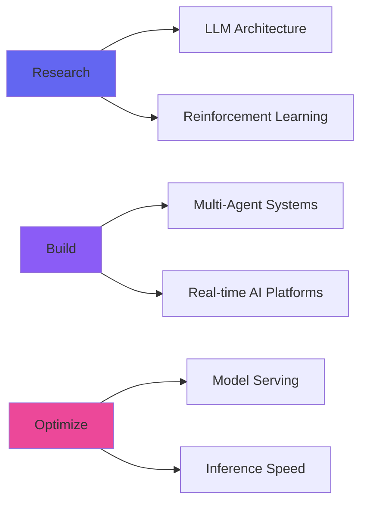

<div align="center">

# 👋 Namaste! I'm Varun Rao

### AI Engineer | Building Intelligent Systems That Actually Work

[](https://git.io/typing-svg)
<div align="center">

</div>

<p>
  <a href="mailto:varunr@iitbhilai.ac.in"></a>
  <a href="https://www.linkedin.com/in/varun-rao-iit-gd-py/"></a>
  <a href="https://github.com/varunrao-ai/varunrao-ai/issues"></a>
</p>

</div>

---

## 🎯 What I Do

```python
class VarunRao:
    def __init__(self):
        self.role = "AI Engineer & ML Systems Architect"
        self.education = "B.Tech Data Science & AI @ IIT Bhilai"
        self.focus = ["LLMs", "Agentic AI", "Optimization", "Production ML"]
        self.impact = "500+ monthly readers learning AI from my articles"
    
    def current_work(self):
        return {
            "building": ["Multi-Agent Systems", "Real-time Intelligence Platforms"],
            "optimizing": ["LLM Inference", "Model Serving at Scale"],
            "researching": ["Distributed Training", "Temporal ML", "RAG Systems"]
        }
    
    def expertise(self):
        return "Turning cutting-edge AI research into production-ready systems"
```


## 🔥 What Makes Me Different

<table>
<tr>
<td width="50%">

### 💡 Technical Excellence
- **Production-First Mindset**: Every model I build is deployment-ready
- **Performance Obsessed**: Optimizing inference latency by 3-5x is my jam
- **System Design**: End-to-end ML pipelines that scale

</td>
<td width="50%">

### 🚀 Business Impact
- **Clear Communication**: Translate AI complexity into business value
- **Fast Iteration**: Ship first, perfect later (with tests!)
- **Knowledge Sharing**: 70+ technical articles helping others learn

</td>
</tr>
</table>

---

## 🛠️ My Arsenal

<details open>
<summary><b>🤖 AI/ML Core</b></summary>
<br/>


**Specializations**: LLM Fine-tuning • RAG Systems • Agent Architectures • Model Optimization
</details>

<details>
<summary><b>⚡ Infrastructure & DevOps</b></summary>
<br/>


**Tools**: FAISS • Vector DBs • CI/CD • MLOps Pipelines
</details>

<details>
<summary><b>💻 Programming & Frameworks</b></summary>
<br/>


**Capabilities**: API Design • System Architecture • Performance Optimization
</details>

---

## 📈 GitHub Activity

<div align="center">
  
  
</div>

<div align="center">
  
</div>

---

## 🎯 Current Focus



### 🔬 Deep Diving Into:
- 🧠 **Distributed Training** for large-scale models
- 📊 **Temporal ML** for time-series intelligence
- 🔗 **Causal Modeling** for robust decision systems
- 🛡️ **AI Safety & Explainability** for trustworthy AI
- ⚡ **High-Performance Serving** for sub-100ms inference

---

## ✍️ Knowledge Sharing

<div align="left">

### 📝 70+ Technical Articles on Medium

**Topics I Write About:**
- Production ML Systems Architecture
- LLM Fine-tuning & Optimization Techniques
- Building Agentic AI Workflows
- Real-world AI/ML Implementation Patterns
  
**Impact**: 500+ monthly readers learning from practical AI engineering

</div>

---

## 🌟 Why Work With Me?

<table>
<tr>
<td>

### 🎯 For Hiring Managers

✅ **Proven Track Record**: Production ML systems at scale  
✅ **Fast Learner**: New frameworks? Give me a weekend  
✅ **Team Player**: Clear docs, clean code, collaborative mindset  
✅ **Business Focused**: ROI > Cool tech (but cool tech is nice too)

</td>
<td>

### 🚀 For Tech Leads

✅ **System Thinker**: End-to-end architecture design  
✅ **Performance Driven**: 3-5x optimization is standard  
✅ **Quality Obsessed**: Tests, monitoring, documentation  
✅ **Mentor Ready**: Love teaching and leveling up teams

</td>
</tr>
</table>

---

## 💬 Let's Talk About

- 🤖 Latest LLM architectures and optimization techniques
- 🔧 Building production-grade ML systems
- 📊 Data science challenges you're facing
- 🚀 AI strategy and implementation roadmaps
- 💡 Open source collaboration opportunities

<div align="center">

### 📫 Best Way to Reach Me

**Open an issue [here](https://github.com/varunrao-ai/varunrao-ai/issues)** for technical discussions  
**Email me at [varunr@iitbhilai.ac.in](mailto:varunrao.gd@gmail.com)** for collaboration opportunities

</div>

---

## 🎨 Fun Facts

> 💻 **My Coding Philosophy**: "Code that reads like poetry, performs like assembly"
> 
> 🌙 **3 AM Debugging**: Where my best (and worst) ideas happen
> 
> ☕ **Powered By**: Maggie, Music, and clean architecture
> 
> 🎯 **Current Obsession**: Making AI systems that are fast, reliable, AND explainable

<div align="center">

### ⭐ If you find my work valuable, star my repositories!

 <em><b>Let's build the future of AI together!</b></em>

---


*Last Updated: December 2024*

</div>
