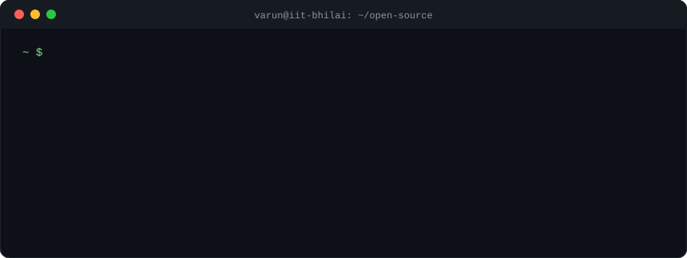

<p align="center">
  
</p>

**AI/ML engineer at IIT Bhilai (B.Tech, Data Science & AI)** building agent reliability tooling, robotics data infrastructure, and ML systems that survive outside notebooks.

[varunrao.is-a.dev](https://varunrao.is-a.dev) · [LinkedIn](https://www.linkedin.com/in/varun3ware/) · [Medium](https://medium.com/@varunrao.aiml) · [X](https://x.com/VarunrRao) · [Email](mailto:varunr@iitbhilai.ac.in)

[](#open-source)
[](https://github.com/Hebbian-Robotics/hflow/pulls?q=is%3Apr+author%3AVARUN3WARE+is%3Amerged)
[](https://github.com/ArgusLabs-ai/ARGUS/pulls?q=is%3Apr+author%3AVARUN3WARE+is%3Amerged)
[](https://github.com/NVIDIA/nvcf/pull/1836)
[](https://pypi.org/project/pytorch-dml/)

---

## Now

```
BUILDING     Human Slop: an anti-AI social platform built on typing forensics
CONTRIBUTING HFlow (Hebbian Robotics) · ARGUS (agent silent-failure detection) · NVIDIA nvcf
SHIPPED      pytorch-dml on PyPI · 19 merged upstream PRs · 70+ articles on Medium
OPEN TO      ML engineering and research roles where prototypes become products
```

---

## Open source

<p align="center">
  
</p>

### [HFlow](https://github.com/Hebbian-Robotics/hflow) · Hebbian Robotics

SDK for robotics teams to verify the quality of the data they train models on · **12 merged PRs**

My work there centers on delivery integrity: making sure a dataset snapshot or LeRobot import can prove it arrived intact, and refusing malformed or hostile input with a clear exit code instead of a traceback.

| Area | What shipped |
| --- | --- |
| **Verification** | `hflow verify lerobot-import` and a shared `VerificationReport` contract for the whole `hflow verify` family ([#454](https://github.com/Hebbian-Robotics/hflow/pull/454)) |
| **Snapshot integrity** | Per-table and per-asset `sha256` receipts plus a `content_id` in `format.json` ([#401](https://github.com/Hebbian-Robotics/hflow/pull/401), closes #397) |
| **LeRobot import** | Imports that publish straight into S3/GCS/Azure data roots ([#377](https://github.com/Hebbian-Robotics/hflow/pull/377)) and resume at episode boundaries after a mid-batch failure ([#390](https://github.com/Hebbian-Robotics/hflow/pull/390)) |
| **Catalog UI** | `hflow catalog ui` on bucket-backed catalogs ([#366](https://github.com/Hebbian-Robotics/hflow/pull/366)), with live rebinding when Parquet lands mid-session ([#538](https://github.com/Hebbian-Robotics/hflow/pull/538)) |
| **Hardening** | Path-escape refusal, SQL statement gating, and malformed-receipt handling ([#515](https://github.com/Hebbian-Robotics/hflow/pull/515), [#564](https://github.com/Hebbian-Robotics/hflow/pull/564), [#576](https://github.com/Hebbian-Robotics/hflow/pull/576), [#672](https://github.com/Hebbian-Robotics/hflow/pull/672)) |

<details>
<summary><b>Full HFlow contribution log (12 merged)</b></summary>

- **[#672](https://github.com/Hebbian-Robotics/hflow/pull/672)** · merged · latest · closes #671. `hflow verify snapshot` now treats an `integrity` key that is present but not a JSON object as a malformed receipt (exit 2), instead of misreporting it as a legacy pre-#401 snapshot.
- **[#639](https://github.com/Hebbian-Robotics/hflow/pull/639)** · merged · closes #638. `hflow curate` and `hflow stale` report DuckDB binder and catalog errors cleanly with exit 2 instead of crashing, while the hosted server keeps its separate 400 mapping.
- **[#576](https://github.com/Hebbian-Robotics/hflow/pull/576)** · merged · closes #575. Refused null or wrong-type `integrity.tables` / `integrity.assets` containers with a clear error instead of an `AttributeError` traceback.
- **[#564](https://github.com/Hebbian-Robotics/hflow/pull/564)** · merged · closes #563. Applied the single-SELECT SQL gate to `hflow curate --dry-run` so it matches the manifest-write path and the hosted server, refusing `DESCRIBE` / `SHOW` / `PIVOT` shapes.
- **[#554](https://github.com/Hebbian-Robotics/hflow/pull/554)** · merged · closes #553. Removed stale "verifier not shipped" wording from the snapshot docs and exporter docstring.
- **[#538](https://github.com/Hebbian-Robotics/hflow/pull/538)** · merged · closes #537. The catalog UI rebinds empty in-memory tables when their Parquet appears mid-session, so tables like `ingest_failures` become queryable without a restart.
- **[#515](https://github.com/Hebbian-Robotics/hflow/pull/515)** · merged · closes #469. Snapshot verification refuses receipt paths that are absolute, contain `..`, or use drive letters before reading them, restoring the "joined only onto the handed directory" guarantee for tenant-supplied snapshots.
- **[#454](https://github.com/Hebbian-Robotics/hflow/pull/454)** · merged. Added `hflow verify lerobot-import` to check prepared-manifest deliveries against their receipts without re-converting, with exit codes 0 clean / 1 damaged / 2 unreadable / 3 unverifiable.
- **[#401](https://github.com/Hebbian-Robotics/hflow/pull/401)** · merged · closes #397. Recorded `path` / `size_bytes` / `sha256` for every snapshot table and copied asset in `format.json`, plus a `content_id` so a deleted member is detectable later.
- **[#390](https://github.com/Hebbian-Robotics/hflow/pull/390)** · merged · closes #303. Multi-episode LeRobot imports resume at episode boundaries, reusing finished episodes only after checking their import identity (source commit, camera keys, converter version).
- **[#377](https://github.com/Hebbian-Robotics/hflow/pull/377)** · merged · closes #304. `hflow import lerobot` publishes directly into `s3://`, `gs://`, and `az://` data roots, writing the manifest only after every episode succeeds.
- **[#366](https://github.com/Hebbian-Robotics/hflow/pull/366)** · merged · closes #305. `hflow catalog ui` opens existing S3/GCS/Azure catalogs through a local mirror, without ever writing to the bucket.

</details>

### [ARGUS](https://github.com/ArgusLabs-ai/ARGUS) · ArgusLabs

Catches silent failures in AI agents before users do · **4 merged PRs**

- **[#118](https://github.com/ArgusLabs-ai/ARGUS/pull/118)** · merged · closes #90. Stopped writing `ARGUS_RUN_ID` on every finished run, which let the last of many batched runs overwrite the pointer so `argus check` graded the wrong run.
- **[#77](https://github.com/ArgusLabs-ai/ARGUS/pull/77)** · merged · closes #73. Added `argus check --strict warn_as_fail` so CI can fail on warning-level tool failures such as HTTP 429s without changing the default behavior.
- **[#68](https://github.com/ArgusLabs-ai/ARGUS/pull/68)** · merged · closes #56. Made ARGUS run its own `pytest --argus` plugin in CI on every PR, so a plugin regression can't hide behind a green pipeline.
- **[#66](https://github.com/ArgusLabs-ai/ARGUS/pull/66)** · merged · closes #53. `pytest --argus` now watches LangGraph `ainvoke`, `stream`, `astream`, `batch`, and `abatch`, not just `invoke`, so silent failures on those paths are caught.

### [NVIDIA nvcf](https://github.com/NVIDIA/nvcf) · NVIDIA

Platform for deploying and routing GPU-accelerated inference, streaming, and batch workloads · **1 merged PR**

- **[#1836](https://github.com/NVIDIA/nvcf/pull/1836)** · merged. Added a build-only Docker Buildx CI job that validates the OpenBao migrations image for both `linux/amd64` and `linux/arm64` without publishing anything.

### Other contributions

- **[kornia](https://github.com/kornia/kornia)** · 2 merged. SEO meta descriptions across 46 documentation modules ([#3129](https://github.com/kornia/kornia/pull/3129)) and a docstring for `_detach_tensor_to_cpu` ([#3131](https://github.com/kornia/kornia/pull/3131)).
- **[shap](https://github.com/shap/shap)** · 2 open. Fixed waterfall plot labels being cut off in saved figures ([#4249](https://github.com/shap/shap/pull/4249)) and `LinearExplainer` ignoring the `link` parameter for classifiers ([#4252](https://github.com/shap/shap/pull/4252)).

---

## Selected work

| Project | What I built |
| --- | --- |
| [Human Slop](https://humanslop.in) | Anti-AI social platform that scores how human a post is from keystroke dynamics (WPM, bursts, pauses), with hardware-bound auth. Deployed on web and mobile. |
| [pytorch-dml](https://github.com/VARUN3WARE/dml-py) · [PyPI](https://pypi.org/project/pytorch-dml/) | PyTorch library for Deep Mutual Learning and knowledge distillation, with AMP, DDP, and ONNX export. 2–5% accuracy gain over independent training. |
| [Hedgera](https://github.com/VARUN3WARE/Hedgera) | Multi-agent trading system combining real-time streaming, RL forecasting, and LLM debate. Led an 8-person team; about 20% returns with 5–8% max drawdown in backtests and paper trading. |
| [Paged-Attention](https://github.com/VARUN3WARE/Paged-Attention) | Implementation of PagedAttention from the vLLM paper, managing the KV cache in pages like virtual memory. |
| [ArthJAX](https://github.com/VARUN3WARE/ArthJAX) | GPU-accelerated agent-based macroeconomic simulator in JAX with households, banks, contagion, and shocks. |
| [RAPIDADB](https://github.com/VARUN3WARE/RAPIDADB) | GPU-native vector database in C++/CUDA and PyTorch for sub-millisecond similarity search. |
| [BPlusSQL](https://github.com/VARUN3WARE/BPlusSQL) | Disk-backed B+ tree storage engine in C++17 with an LRU buffer pool and write-ahead logging. |
| [Kerala Ayurveda RAG](https://github.com/VARUN3WARE/Kerala-Ayurveda-RAG) | Medical RAG system using corrective RAG and hybrid BM25 + vector retrieval. Under 10% hallucination rate on RAGAS. |
| [evalforge](https://github.com/VARUN3WARE/evalforge) | Engine that scores and stress-tests ML models for reliability, robustness, and hidden failures before deployment. |

---

## Experience

- **AI Developer Intern, Kartavya Technology** (remote, Jun–Aug 2024). Built multi-agent automation and cloud APIs on AWS and GCP; cut manual effort by 40% and infrastructure costs by 25%.
- **Team Lead, Autonomous Financial Intelligence Platform** (IIT Bhilai, Oct–Dec 2025). Led the 8-person team behind Hedgera.
- **Coordinator, Data Science & AI Club, IIT Bhilai.** Ran workshops and hackathons.

## Achievements

- **Kaggle Expert.** Silver medal in the MITSUI Commodity Prediction Challenge (rank 36 of 1,711); top 10% in GQ Volatility Forecasting (rank 34 of 386).
- **Amazon ML Challenge 2025.** All-India rank 278.
- **Winner, Pixel Perfect Hackathon** (IIT Bhilai). Improved the baseline by 23%.
- **Technical writer.** 70+ ML articles on Medium with 800+ monthly readers.

## Toolbox

```
LANGUAGES   Python · C++ · Rust · SQL · TypeScript · JavaScript · Bash
ML / AI     PyTorch · JAX · TensorFlow · scikit-learn · Hugging Face · XGBoost · OpenCV
AGENTS      LangChain · LangGraph · RAG · multi-agent systems · evals
DATA        DuckDB · Parquet · PostgreSQL · MongoDB · Neo4j · FAISS · ChromaDB
INFRA       CUDA · Docker · Kubernetes · AWS · GCP · FastAPI · GitHub Actions · MLflow
```

---

<p align="center">
  
</p>

`train → evaluate → break it on purpose → ship`
